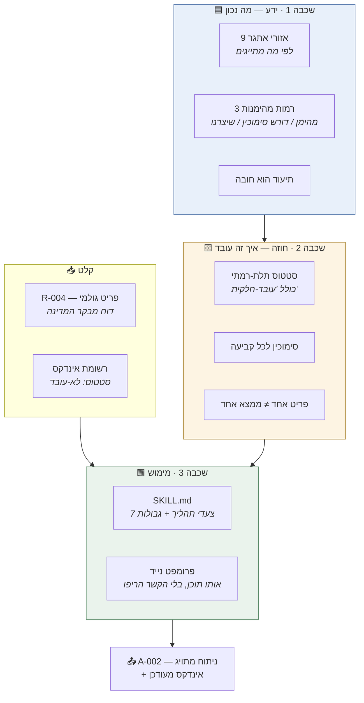
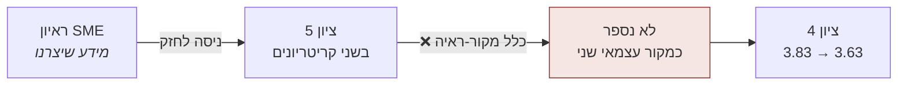
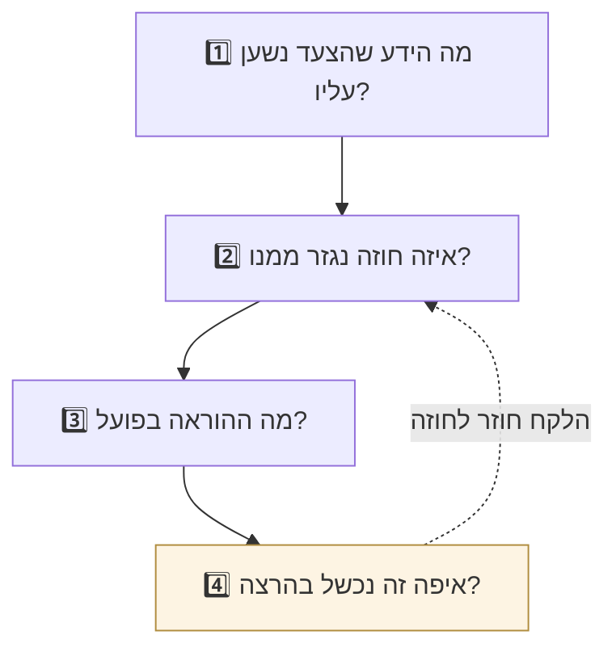

# אנטומיה של צעד — איך שלוש השכבות מתחברות לפעולה אחת

> **המסמך הזה קיים פעם אחת בכוונה.** מי שמבין את הדפוס על צעד אחד — מבין את כל 41.
> 41 קבצים כאלה היו סותרים את "קישור, לא שכפול" ומתחילים לסטות מהמקור תוך שבועיים.
>
> נוצר בעקבות משוב הצוות המיישם, 03.09.2026.

## התובנה שהצוות ניסח

> **מימוש של כל צעד = Skill + ידע שקיים בקבצי MD + הגדרת פרומפט.**

נכון. וכל אחד משלושת הרכיבים חי **בשכבה אחרת**, ואף אחד לא ראה אותם מורכבים.

---

# הצעד שנפרק: `pf-content-analysis`

בחרנו אותו כי הוא **הצעד השני בצינור** — מספיק מוקדם כדי שההקשר פשוט, ומספיק עשיר כדי שכל שלוש השכבות באמת ישפיעו עליו.

---

## 🟦 שכבה 1 — הידע שהצעד נשען עליו

**איפה זה חי:** פרקים 00-07 · **מי משנה:** הנהלת המטה · **קצב:** לאט

| מה | הקובץ | מה זה תורם לצעד |
|---|---|---|
| 9 אזורי האתגר | [אזורי-אתגר-לאומיים](../01-מפעל-הבעיות/אזורי-אתגר-לאומיים.md) | הטקסונומיה שלפיה מתייגים. **בלעדיה הסוכן ימציא קטגוריות** |
| 3 רמות מהימנות | [מקורות-מידע](../01-מפעל-הבעיות/מקורות-מידע.md#תיקוף-מידע-וסיווג-מהימנות) | קובע מה מותר לעשות עם הפריט בהמשך |
| תיעוד הוא חובה | [עקרונות-על](../00-חזון-ועקרונות/README.md#עיקרון-העל-תיעוד-הוא-חובה-לא-אופציה) | למה בכלל שומרים ניתוח נפרד |

> ⚠️ **בלי השכבה הזו הסוכן עדיין "יעבוד" — ויתייג לקטגוריות שהמציא.** זו הכי מסוכנת מבין הכשלים: הפלט נראה תקין.

## 🟨 שכבה 2 — החוזה שנגזר מהידע

**איפה זה חי:** פרק 08 · **מי משנה:** ארכיטקט + שותף · **קצב:** בסבבי עיצוב

מ-[A-הזנה-וסיווג](01-מפעל-הבעיות/A-הזנה-וסיווג.md):

| ההחלטה | הנימוק |
|---|---|
| **סטטוס תלת-רמתי**, לא בינארי | פריט גולמי מכיל לרוב כמה ממצאים. סטטוס בינארי גורם ל"עובד" שקרי |
| **פריט אחד ≠ ממצא אחד** | לספור ממצאים לפני שמנתחים |
| הפלט מסווג **"מידע שיצרנו"** | ניתוח פנימי אינו ראיה עובדתית |

> ⭐ **ההחלטה הראשונה נולדה מכישלון.** בסבב 1 הסוכן סימן "עובד" אחרי ממצא אחד — **וארבעה ממצאים נעלמו בשקט.** השכבה הזו היא המקום שבו לקחי הרצה הופכים לכלל.

## 🟩 שכבה 3 — המימוש

**איפה זה חי:** `.claude/skills/` + `08/פרומפטים/` · **קצב:** בכל תיקון

| הגרסה | הקובץ | מתי משתמשים |
|---|---|---|
| Skill | [`pf-content-analysis`](../.claude/skills/pf-content-analysis/SKILL.md) | בתוך קלוד — נטען אוטומטית |
| פרומפט נייד | [pf-content-analysis](פרומפטים/pf-content-analysis.md) | כל מודל אחר |

**מה ה-Skill מכיל בפועל:** אחריות יחידה · טריגר · קלט · **7 צעדי תהליך** · כלל הסטטוס · פלט · **גבולות** · טבלת המהימנות · שרשור · רקע

---

# ההרצה בפועל

## מה נכנס

מתוך [R-004](../../כורי-בינה/כור-מעבדה/01-מפעל-הבעיות/גולמי/רשת/R-004-מבקר-המדינה-רצף-טיפול-בקשישים.md):

> ליקוי חוזר: **העדר רצף טיפול** בין בית חולים, קופת חולים ושירותי רווחה עבור מטופלים מבוגרים לאחר אשפוז.
> · כ-30% מהמאושפזים בני 75+ חוזרים לאשפוז תוך 30 יום
> · נדרשות בממוצע 4.5 פניות של בן משפחה לסגירת מעגל אחד
> · הליקוי צוין בשלושה דוחות קודמים ולא תוקן

## מה יצא

מתוך [A-002](../../כורי-בינה/כור-מעבדה/01-מפעל-הבעיות/ניתוחים/A-002-רצף-טיפול-בקשישים.md):

| שדה | הערך | **מאיזו שכבה זה בא** |
|---|---|---|
| אזור אתגר ראשי | 1 · הזדקנות מיטבית | 🟦 מהטקסונומיה |
| סיווג הפלט | **מידע שיצרנו** | 🟦 משלוש הרמות |
| כל ראיה עם מקור | טבלה עם עמודת מקור | 🟨 מהחוזה |
| הבחנה סימפטום/שורש | דרגה 2-3 | 🟩 מצעד 3 בתהליך |
| סטטוס אינדקס | עודכן | 🟨 מכלל הסטטוס |

## ⭐ ומה שקרה אחר כך

הסוכן תייג את הפלט של עצמו **"מידע שיצרנו"**. בסבב 1 זה נראה כמו פרט טכני.

**בסבב התיקונים התברר שזה בדיוק מה שמנע ניקוד מנופח:**

> **כלל משכבה 1 שינה תוצאה בשכבה 3 — דרך חוזה בשכבה 2.** זו ההוכחה שהשכבות באמת עובדות יחד, ולא רק על התרשים.

---

# איך לקרוא כל צעד אחר

הדפוס זהה בכל 41:

| השאלה | איפה התשובה |
|---|---|
| 1 · הידע | סעיף "רקע בוויקי" ב-Skill → מוביל לפרקים 00-07 |
| 2 · החוזה | מסמך העיצוב בפרק 08 — סעיף "החלטות מפתח" |
| 3 · ההוראה | ה-Skill עצמו · או הפרומפט הנייד |
| 4 · הכישלון | דוחות ההרצה — [סבב 1](../../כורי-בינה/כור-מעבדה/01-מפעל-הבעיות/דוח-סבב-1.md) · [סבב 2](../../כורי-בינה/כור-מעבדה/02-הגדרת-המיזם/דוח-סבב-2.md) |

> **שאלה 4 היא החשובה.** ההחלטות המעניינות ביותר בשכבה 2 לא נולדו בעיצוב — הן נולדו מכישלון בהרצה. מי שקורא רק את השכבות מפספס את הסיבה שהן נראות כך.

---

## קישורים

[מפת הזרימה המלאה](00-מפת-הזרימה-המלאה.md) · [שיטת העבודה והלקחים](00-שיטת-העבודה-ולקחים.md) · [כל הפרומפטים](פרומפטים/README.md)
