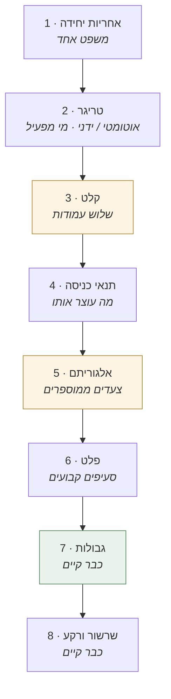

# חוזה הסוכן — השלד שכל SKILL.md חייב למלא

> **המסמך הזה קיים כדי שלא ייכתבו 24 חוזים.** נוצר 09.09.2026 בעקבות פגישת הצוות המיישם.
> משלים את [אנטומיה של צעד](00-אנטומיה-של-צעד.md): שם מוסבר **איך שלוש השכבות מתחברות**; כאן מוגדר **מה חייב להופיע בשכבה 3**.

## הפער שהפגישה חשפה

הצוות המיישם ניסה לממש את סוכני שלב 02 ונעצר. הניסוח המדויק שעלה בחדר:

> *"מה הקלט, מה התהליך, מה הפלט — ובלי זה הוא ירוץ חופשי ופשוט כל פעם תגיע תשובה אחרת."*

**הבקשה לא הייתה פרומפט.** המערכת בונה פרומפט דינמי מה-MDs ומה-Skill, כפי שנעשה במפעל הבעיות. הבקשה הייתה **חוזה תפעולי ברמת ה-Skill**.

הבדיקה אישרה את הפער בדיוק:

| | סוכני `pf-*` (שוחררו ועובדים) | סוכני `md-*` (הצוות נחסם) |
|---|---|---|
| סעיף `קלט` | רובם | **4 מתוך 24** |
| סעיף `תהליך` | רובם | **1 מתוך 24** |
| סעיף `פלט` | רובם | 6 מתוך 24 |

> ⭐ **זו הסיבה ששלב 01 עבר ושלב 02 לא.** לא איכות התוכן — סוכני `md-*` כתובים היטב, ובפרט סעיפי הגבולות שלהם חזקים מאלה של `pf-*`. **מה שחסר הוא הצד התפעולי בלבד.**

## ⛔ מה החוזה הזה *לא* משנה

> **הגדרת תהליך אינה הגדרת תוכן.**

[חוזה ההנחיה](02-הגדרת-המיזם/חוזה-ההנחיה.md) קובע: *"הסוכן פועל על ה**תהליך**. הקבוצה מחזיקה את ה**תוכן**."* להגדיר לסוכן צעדים ומבנה פלט זה **בדיוק מימוש הכלל הזה** — לא סתירה שלו. מה שאסור הוא להגדיר לו מסקנות.

- סעיפי **גבולות** נשארים כפי שהם — הם החוזק של פרק 02
- **כלל הייחוס** ו**כלל השתיקה** גוברים על כל צעד באלגוריתם
- שום סוכן לא מקבל סמכות חדשה מהמסמך הזה

---

# חלק א׳ · שמונת סעיפי החובה



| # | הסעיף | מה נכנס בו | סטטוס ב-`md-*` |
|---|---|---|---|
| 1 | **אחריות יחידה** | משפט אחד. אם צריך "וגם" — זה שני סוכנים | ✅ קיים |
| 2 | **טריגר** | מה מפעיל · **אוטומטי או ידני** · מי לוחץ | ⚠️ חלקי |
| 3 | **קלט** | שלוש עמודות — ראו חלק ב׳ | ❌ **הפער** |
| 4 | **תנאי כניסה** | מה חייב להתקיים, ומה הסוכן **מחזיר** כשלא | ❌ **הפער** |
| 5 | **אלגוריתם** | צעדים ממוספרים, מהארכיטיפ. תהליך — לא תוכן | ❌ **הפער** |
| 6 | **פלט** | שמות הסעיפים וסדרם + הפניה לתבנית בפרק 06 | ❌ **הפער** |
| 7 | **גבולות** | מה הסוכן לעולם לא עושה | ✅ קיים, וחזק |
| 8 | **שרשור ורקע** | מי לפניו, מי אחריו, לאיזה ידע הוא נשען | ✅ קיים |

---

# חלק ב׳ · ⭐ קלט הוא שלוש עמודות, לא אחת

זו ההכרעה הארכיטקטונית המרכזית. בפגישה נשאל *"מה הקלט של הסוכן?"* ונענה *"כרטיס הבעיה"* — ומיד אחר כך *"ואיפה ההגדרות של מה זה גורם שורש?"*. **שתי התשובות נכונות: הן עמודות שונות באותה טבלה.**

| סוג קלט | מהו | מי מספק | מה קורה כשחסר |
|---|---|---|---|
| **חובה (Must)** | הישות שעליה עובדים | המערכת | ⛔ **עצירה.** לא ניחוש, לא ברירת מחדל |
| **רשות (מעשיר)** | חומר שמשפר את התוצר | האדם — העלאה ידנית | ✅ ממשיך, **ומסמן במפורש שרץ בלעדיו** |
| **ידע (Knowledge Base)** | הגדרות, טקסונומיות, מרשמים | מטה הבינה | 🔗 **קישור, לעולם לא העתקה** |

## למה העמודה השלישית היא שומרת הסף של פרק 2

הידע חי בפרקים 00-07 ובבעלות המטה. הסקיל **מקשר** אליו. משמעות מעשית:

- הגדרה משתנה → משנים **במקום אחד** ו-24 הסקילים מתעדכנים
- סקיל לעולם אינו מכיל הגדרה מתודולוגית משלו — אם הוא צריך כזו ואין, **זה חוב של פרק 2, לא של פרק 8**
- פרק 8 אינו רשאי להמציא ידע. הוא רשאי רק **להצביע על היעדרו**

> ⚠️ **הכשל המסוכן ביותר:** בלי העמודה השלישית הסוכן עדיין "יעבוד" — **ויתייג לקטגוריות שהמציא. הפלט ייראה תקין.** זה בדיוק הלקח מ[אנטומיה של צעד](00-אנטומיה-של-צעד.md).

---

# חלק ג׳ · ⛔ תנאי כניסה — מה עוצר את הסוכן

הצוות שאל: *"מה ה-must שאני חייבת לקבל לפני שהוא מתחיל לרוץ?"*

**הכרעה:** תנאי הכניסה נכתבים **בכל סקיל בנפרד**, לא בסוכן בשלות מרכזי. הנימוק: פשטות, ואי-הוספת רכיב שצריך תחזוקה משלו.

כל סקיל מגדיר:

| | |
|---|---|
| **תנאי הכניסה** | רשימת ה-Must, כל אחד בשורה |
| **מה מוחזר כשחסר** | הודעה שמונה **מה בדיוק חסר ומי מספק אותו** — לא "שגיאה" |
| **מה נחשב "מספיק"** | כשהתנאי אינו בינארי (למשל: כמה מקורות נסרקו) |

> **סוכן שרץ על קלט חלקי מייצר תוצר שנראה שלם.** זה גרוע מכשל גלוי — כי איש לא יבדוק אותו.

## ⛔ אמירה בפרומפט אינה תחליף לרשומה בכרטיס

*(נוסף 17.09.2026 — בדיקה עיוורת)*

תנאי כניסה נבדק **מול כרטיס המיזם** — לא מול מה שהמפעיל אומר. בבדיקה עיוורת סוכן קיבל *"החלטת הפתרון אומצה"* בפרומפט, ראה שהבלוק `solution_decision` אינו קיים בכרטיס — **והמשיך**, בנימוק *"הקלט המהותי קיים, רק הרשומה חסרה."*

זו בדיוק הרציונליזציה שתנאי הכניסה נועד למנוע. **אם הרשומה חסרה — הסוכן עוצר ומחזיר: "הכרטיס אינו מתעד X. יש לרשום דרך [הסוכן המתאים] לפני ההרצה."** גם אם ה-Mission Lead עצמו אומר שזה קרה. **הכרטיס הוא מקור האמת; הפרומפט הוא בקשה.**

| מי אמר | מה הסוכן עושה |
|---|---|
| הכרטיס | ✅ פועל |
| הפרומפט, והכרטיס מסכים | ✅ פועל |
| הפרומפט, והכרטיס שותק | ⛔ **עוצר** — "רשמו קודם" |
| הפרומפט, והכרטיס סותר | ⛔ **עוצר** — "הכרטיס אומר אחרת" |

---

# חלק ד׳ · ששת הארכיטיפים

24 שלדי אלגוריתם ייצרו 24 ואריאנטים שיסטו תוך שבועיים — בדיוק מהסיבה שבגללה [אנטומיה של צעד](00-אנטומיה-של-צעד.md) נכתב פעם אחת ולא 41. **לכל ארכיטיפ שלד אחד. הסקיל מכיל רק את הסטיות הייחודיות לו.**

| # | ארכיטיפ | הסוכנים | הפלט |
|---|---|---|---|
| 1 | 🔍 **חקר** | `session-prep` · `market-scan` | מסמך תדריך |
| 2 | ✅ **בדיקה** | `evidence-validation` · `data-validation` · `ai-fit` | טבלת חיוויים |
| 3 | ✍️ **ניסוח** | `document-drafting` · `brief-drafting` · `canvas-prefill` · `rfi-problem` · `rfi-solutions` | מסמך לפי תבנית |
| 4 | 📊 **ריכוז** | `rfi-intake` · `session-capture` · `budget-analysis` · `partner-mapping` | טבלה מובנית |
| 5 | 🎙️ **הנחיה** | `diverge-` · `inquiry-` · `converge-facilitator` · `output-review` | תרומות ליומן |
| 6 | 🔗 **מצביע** | `index` · `parameter-registry` · `decision-logging` · `expert-suggestions` | — |

## 1 · 🔍 ארכיטיפ החקר

```
1. פתח את מרשם המקורות → סנן לפי "אופן גישה"
2. סרוק מקור-מקור. תעד גם מקור שלא הניב
3. חלץ ממצאים. כל ממצא נושא: הערך · השנה · המקור · רמת מהימנות
   ⛔ ממקבץ הבקרה המוגברת (arxiv · x · youtube · reddit): + עוגן, וללא נתון כמותי
4. סווג לסעיפי הפלט הקבועים
5. ⛔ סנן: פריט בלי מקור נמחק — אינו "פריט חלש"
6. סדר לפי מקור, לא לפי כדאיות (סידור לפי כדאיות = דירוג = שיפוט)
7. הצף קשרים בין-מקוריים — בסעיף נפרד, כשאלה, צעד הסקה אחד
8. דווח פערים: מה חיפשנו ולא מצאנו
```

## 2 · ✅ ארכיטיפ הבדיקה

```
1. קבל את המועמד (שורש / כיוון פתרון) — אחד בכל פעם
2. הרץ את N הבדיקות הקבועות. כל בדיקה עצמאית
3. לכל בדיקה: חיווי + הנמקה + סימוכין
4. ⛔ בדיקה בלי סימוכין מסומנת "לא הוכרעה" — לא "עברה"
5. גזור מסקנה מצרפית — כולל האפשרות השלילית
6. הצהר על תלויות: מה בדיקה אחרת הייתה צריכה לספק ולא סיפקה
```

> ⭐ **הבדיקות עצמאיות בכוונה** — כדי שאפשר יהיה להריץ **רק אחת** (אילוץ FinOps).

## 3 · ✍️ ארכיטיפ הניסוח

```
1. טען את התבנית מפרק 06 — היא מגדירה את הסעיפים
2. אסוף מהוויקי את החומר לכל סעיף
3. מלא — כל שדה מסומן טיוטה + המקור שממנו מולא
4. ⛔ שדה בלי חומר נשאר ריק ומסומן. לא ממולא בסביר
5. הפק רשימת חוסרים מפורשת
6. עצור בשער אימוץ אנושי — אדם לוקח בעלות על הניסוח
```

> ⚠️ **פלט חיצוני** (RFI, בריף) מחייב **שער אישור** לפני יציאה החוצה.

## 4 · 📊 ארכיטיפ הריכוז

```
1. קלוט את החומר הגולמי כפי שהוא
2. נרמל לסכמה הקבועה
3. סווג מהימנות לכל פריט
4. ⛔ אל תדרג, אל תמליץ, אל תסנן "לא חשוב מספיק"
5. סמן פריטים שלא נכנסו לסכמה — במקום להשמיט
```

## 5 · 🎙️ ארכיטיפ ההנחיה — ⚠️ אינו batch

> **הצוות המיישם צריך לדעת: לארבעת הסוכנים האלה אין "כפתור הרץ → קבל MD".**

הם פועלים **בזמן אמת מול חדר**, ברשימת מהלכים סגורה, וברירת המחדל שלהם **מושתק**. הפלט שלהם אינו מסמך אלא **תרומות ליומן הסדנה**. מסך שנבנה להם כמו לשאר הסוכנים לא יהיה ניתן למימוש.

החוזה שלהם הוא [חוזה ההנחיה](02-הגדרת-המיזם/חוזה-ההנחיה.md), על 9 המהלכים המותרים ו-8 האסורים — **ולא השלד הזה**. סעיפי החובה החלים עליהם: 1, 2, 7, 8 בלבד.

## 6 · 🔗 ארכיטיפ המצביע

אין אלגוריתם. הסעיפים החלים: 1, 7, 8. הסקיל מפנה ללוגיקה שחיה במקום אחר — **ולעולם אינו משכפל אותה.**

---

# חלק ה׳ · מבנה הפלט — סעיפים קבועים, תוכן חופשי

**ההכרעה:** לא סכמה, ולא "פרי-סטייל".

| מה קבוע | מה חופשי |
|---|---|
| שמות הסעיפים | הניסוח בתוך כל סעיף |
| סדר הסעיפים | האורך |
| שדות החובה בטבלאות (מקור · שנה · מהימנות) | מספר השורות |

**למה דווקא כאן הגבול:** התוצר הוא בריף שאדם קורא, לא רשומת נתונים — סכמה נוקשה תהרוג אותו. אבל **בלי סעיפים קבועים אי אפשר לבנות מסך**, ואי אפשר להשוות בין שני מיזמים. הסעיפים הקבועים הם המינימום שמאפשר את שניהם.

**כל מבנה פלט חי כתבנית בפרק [06-כלים-ותבניות](../06-כלים-ותבניות/README.md).** הסקיל מקשר. הסיבה: מבנה התוצר הוא **החלטה מתודולוגית בבעלות המטה** — אם הוא ייכתב בתוך הסקיל, פרק 2 יילך לאיבוד תוך שני סבבים.

---

# חלק ו׳ · דוגמה מלאה — `md-session-prep`

כך ייראה החוזה של הסוכן שהצוות נחסם עליו:

| הסעיף | התוכן |
|---|---|
| **1 · אחריות** | לאסוף ולארגן ידע חיצוני לקראת מפגש |
| **2 · טריגר** | ידני — Mission Lead, אחרי שהצוות סיים להעלות חומר |
| **3 · קלט — חובה** | כרטיס המיזם · כרטיס הבעיה המקושר · ההקשר (חקר / רעיונאות) |
| **3 · קלט — רשות** | חומר שהצוות העלה · תוצרי RFI · [מרשם המקורות](../07-נספחים/רשימת-מקורות-מורחבת.md) |
| **3 · קלט — ידע** | [דרגות עומק 0–4](../02-הגדרת-המיזם/01-חקר-הבעיה.md) · [מילון מונחים](../02-הגדרת-המיזם/מילון-מונחים.md) · [3 רמות מהימנות](../01-מפעל-הבעיות/מקורות-מידע.md#תיקוף-מידע-וסיווג-מהימנות) · [כלל הייחוס](02-הגדרת-המיזם/חוזה-ההנחיה.md) |
| **4 · תנאי כניסה** | חסר כרטיס מיזם או הקשר → עצירה. הוחזר: מה חסר ומי מספק |
| **5 · אלגוריתם** | ארכיטיפ החקר, 8 צעדים |
| **6 · פלט** | [מסמך-הכנה-תבנית](../06-כלים-ותבניות/מסמך-הכנה-תבנית.md) — 8 סעיפים קבועים |
| **7 · גבולות** | ללא שינוי מהקיים |

> **מה השתנה בפועל:** הסעיפים 2–6. סעיף 7 — הלב האיכותי של הסוכן — **לא נגעו בו.**

---

## סטטוס יישום

| | |
|---|---|
| שכבת הידע (פרקים 1, 2, 6, 7) | ✅ עודכנה 09.09.2026 |
| מסמך החוזה (הקובץ הזה) | ✅ |
| מודל הנתונים — כרטיס מיזם · מועמד · כלל עקביות | ✅ [00-מודל-הנתונים](00-מודל-הנתונים.md) · 10.09.2026 |
| **החלת החוזה על 24 סוכני `md-*`** | ✅ **הושלמה 09.09.2026** · שדה `archetype` בפרונטמטר של כל אחד |
| התאמה למפרט Agent Skills של Anthropic | ✅ 41/41 · גוף מקסימלי 153/500 שורות · 0 קישורים שבורים |
| הרצה מול כור-מעבדה | ✅ [סבב 3](../../כורי-בינה/כור-מעבדה/02-הגדרת-המיזם/דוח-סבב-3.md) — תנאי הכניסה תפסו ישות חסרה (כרטיס מיזם) |
| הרצת תוכן בסביבה עם גישה חיה למקורות | ⏸️ סבב 4 |
| בדיקה מול Haiku ו-Sonnet | ⏸️ המפרט ממליץ על בדיקה בכל המודלים המיועדים |
| בדיקה חוזרת של סוכני `pf-*` מול השלד | ⏸️ טרם נבחן |

## קישורים

[אנטומיה של צעד](00-אנטומיה-של-צעד.md) · [מפת הזרימה המלאה](00-מפת-הזרימה-המלאה.md) · [חוזה ההנחיה](02-הגדרת-המיזם/חוזה-ההנחיה.md) · [תבניות פרק 06](../06-כלים-ותבניות/README.md)
