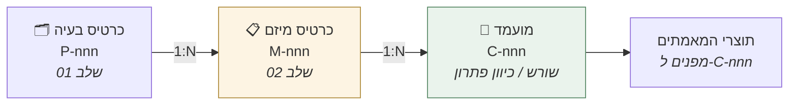

# מודל הנתונים — הישויות שהסוכנים קוראים וכותבים

> נוצר 10.09.2026, אחרי ששלוש בדיקות עיוורות נעצרו באותו מקום.
> משלים את [חוזה הסוכן](00-חוזה-הסוכן.md): שם מוגדר **מה כל סקיל חייב להכיל**; כאן מוגדר **מה הישויות שהוא מקבל**.

## הפער שהוליד את המסמך

24 סוכנים מצהירים על **כרטיס המיזם** כקלט חובה, ורושמים *"מספק: המערכת"*. אבל כרטיס המיזם הוא **קובץ Markdown חופשי עם תיבות סימון שאדם מילא ביד**.

הצוות המיישם ניסח את זה מדויק:

> *"לא כתוב איזה שדה נקרא מאיפה, ואין סכמה."*

ושתי בדיקות נוספות נעצרו על אותה ישות מזוויות אחרות: אחת מצאה שהכרטיס **פיגר סבב שלם** אחרי תוצריו; השנייה, שאין ישות **"מועמד"** ולכן תנאי כניסה שכתוב במלואו אינו ניתן למימוש.

> ⭐ **הפכתי ישות בלתי-מוגדרת לקלט החובה של כל השלב.** זה המסמך שסוגר את זה.

---

# חלק א׳ · שלוש הישויות



| הישות | נוצרת ע"י | חיה ב |
|---|---|---|
| **כרטיס בעיה** `P-nnn` | `pf-problem-classification` (הצעה) + אישור Domain Lead | `01-מפעל-הבעיות/בעיות/` |
| **כרטיס מיזם** `M-nnn` | ⬜ **ה-Mission Lead**, בכניסה לשלב 02 | `02-הגדרת-המיזם/מיזמים/` |
| **מועמד** `C-nnn` | ⬜ **הקבוצה בסדנה** — נרשם ע"י `md-session-capture` | רשומה בכרטיס המיזם |

---

# חלק ב׳ · ⭐ ההפרדה: Frontmatter לקריאה מכנית, גוף לקריאה אנושית

**הסכמה חיה ב-frontmatter. הגוף נשאר Markdown חופשי.**

זה בדיוק הדפוס שכל 41 הסקילים כבר משתמשים בו — ולכן אינו מוסיף מוסכמה חדשה לריפו.

| | Frontmatter | גוף המסמך |
|---|---|---|
| מי קורא | **מערכת ה-web · הסוכנים** | בני אדם |
| מה יש בו | שדות מוקלדים · מזהים · סטטוסים · נתיבים | הנמקה · מסגור · ניואנס |
| מה קורה בסתירה | ⛔ **ה-frontmatter קובע** | — |

> **למה לא סכמה מלאה:** התוצרים הם בריף שאדם קורא, לא רשומת נתונים. סכמה נוקשה תהרוג אותם — וזו הייתה ההכרעה על "סעיפים קבועים, תוכן חופשי". **ה-frontmatter מוסיף את המינימום שמאפשר מסך ובדיקה, בלי לגעת בתוכן.**

## סכמת כרטיס המיזם

```yaml
id: M-001
name: סגירת מעגל הטיפול לאחר שחרור מאשפוז
problem_id: P-001              # ⭐ החיבור ליחס 1:N
sibling_missions: []           # מיזמים אחרים על אותה בעיה
mission_lead: "שם מלא"         # ממונה ע"י ה-COO בשער היציאה מ-01
opened_at: 2026-09-09

framing:
  covers: "הזווית שהמיזם תוקף"
  does_not_cover: ["...", "..."]     # ⛔ רשימה ריקה = הכרטיס אינו ממוסגר
  rejected_framings: [{framing: "...", reason: "..."}]

from_handoff:
  degree0_statement: "..."     # ⭐ שדה חובה — בלעדיו md-rfi-problem עוצר
  score: 3.81
  band: "3.0-3.9"
  open_escalation_trigger: null      # דגל שלא נסגר נוסע עם הכרטיס
  joker_used: false
  domain_experts: ["..."]

status:
  substage: roadshow           # חקר-הבעיה | רעיונאות | lean-canvas | rfi-פתרונות | roadshow | בחירת-הפתרון | עיצוב-המוצר | מפת-דרכים | pov
  state: active                # active | frozen | returned-to-factory
  last_gate: {name: "...", approved_by: "...", at: 2026-09-09}

# ⭐ האות שחסר לגמרי — טריגר ההפעלה של md-session-prep
uploads:
  complete: true               # "הצוות סיים להעלות חומר"
  marked_by: "שם"
  at: 2026-09-09
  items: [{path: "...", type: תמלול-SME, reliability: דורש-סימוכין}]

candidates:                    # ⭐ הישות שלא הייתה קיימת
  - id: C-001
    type: שורש                 # שורש | כיוון-פתרון | ספק   ← "ספק" נוסף לשלב 3.1
    text: "..."                # ניסוח ספציפי — לא כותרת
    depth: 3                   # 0-4 · ⚠️ ראו סייג דרגה 4
    origin: "סדנה 1, 2026-08-31"
    status: נבחר               # מועמד | נבחר | נדחה | נבלע
    validations: {ai_fit: "path", evidence: null, data: "path", market: null}

# ⭐ שלב 3.1 — נוסף 17.09.2026
solution_decision:
  adr_path: "3-mvp-poc/1-בחירת-הפתרון/ADR-0001.md"
  chosen: "C-007"              # מזהה המועמד מסוג ספק, או Build
  decided_by: "שם"             # ⬜ אדם — אצל השותף
  decided_at: 2026-10-01
  alternatives_rejected: [{candidate: "C-005", reason: "..."}]
  adopted: false               # האימוץ האנושי של ה-ADR

# ⭐ כרטיס הפתרון — נוסף 17.09.2026 (בדיקה עיוורת ג׳: "הזרע של כל שלב 3 נשלף מטבלת Markdown חופשית")
solution_card:
  path: "2-רעיונאות/כרטיס-פתרון.md"
  core_assumption: "..."       # ⭐ הנחת הליבה — הזרע של שאלת ה-MVP
  poc_minimal: "..."
  adopted: false
  adopted_by: ""

# ⭐ שלב 3.2 — נוסף 17.09.2026
mvp_question:
  question: "..."              # אחת · בדידה · בת-אימות
  business_goal: "..."         # מהקנבס
  critical_hypothesis: "..."   # = הנחת הליבה מכרטיס הפתרון
  included: ["..."]
  excluded: ["..."]            # ⛔ ריק = אינו MVP
  test_env: {users: 0, data: "...", weeks: 0}
  positive_criterion:          # ⭐ מוקלד — לא מחרוזת חופשית (17.09, בדיקה עיוורת ג׳)
    text: "מעגל הטיפול נסגר תוך 7 ימים ב-70% מהשחרורים לפחות"
    metric: loop_closed_7d_rate
    operator: ">="
    threshold: 0.70
  decider: {name: "", role: ""}   # ⬜ אדם — הסוכן לעולם לא ממלא · role פתוח (הנחה 1) אך name חובה
  status: טיוטה                # טיוטה | נבדקה | אומץ
  adopted_at: null
  adopted_by: ""               # = decider.name
  # ⛔ ההקפאה כנתון — המערכת מעתיקה באימוץ · לקריאה בלבד · ההשוואה מכנית, לא סוכן שקורא שני מסמכים
  criterion_frozen: null       # {metric, operator, threshold, frozen_at, frozen_from: adopted_by}
architecture:
  doc_path: "3-mvp-poc/2-עיצוב-המוצר/architecture-doc.md"
  status: טיוטה                # טיוטה | נבדקה | אומץ
  adrs: []

# ⭐ שלב 3.3 — נוסף 17.09.2026
roadmap:
  doc_path: "3-mvp-poc/3-מפת-הדרכים/roadmap.md"
  stages_defined: [0,1,2,3]    # 0=MVP · 1=Production · 2=PMF · 3=Scale — לפי פרק 4
  impact_metrics_ref: "1-חקר-הבעיה/מסמך-הגדרת-בעיה.md#5"   # ⛔ מדדי שלב 3 מועתקים משם
  agreed_by: []                # ⬜ אדם — [{stakeholder, name, at}] · הגייט דורש את כולם
  status: טיוטה                # טיוטה | נבדקה | מוסכמת

# ⭐ שלב 3.4 — נוסף 17.09.2026
pov:
  experiment_doc: "3-mvp-poc/4-הוכחת-ערך/ניסוי.md"
  criterion_ref: "mvp_question.positive_criterion"   # ⛔ קפוא — ההשוואה תמיד מולו
  status: מתוכנן              # מתוכנן | הורץ | הוכרע
  run:                         # ⭐ הריצה כישות (17.09)
    started_at: null
    ended_at: null
    n_planned: 100             # = test_env.sample_size
    n_actual: null             # ⛔ n_actual < n_planned → "ריצה חלקית" — מכני
    closed_by: ""              # ⬜ הצוות הבונה מסמן "הסתיימה"
  measured:                    # ⭐ מוקלד (17.09)
    primary: {metric: loop_closed_7d_rate, value: null, n: null, source: ""}   # metric חייב = criterion_frozen.metric
    secondary: []              # [{metric, value, source}] — לתובנה, לא להכרעה
    breakdown: {}              # {segment: {n, value}} — ⛔ segment ב-excluded → עצירה
  met: null                    # כן | לא | לא-ניתן-להכריע — נגזר: primary.value <operator> criterion_frozen.threshold · "כמעט" = לא
  gate:
    value_proven: {status: null, by: ""}      # ⬜ decider · status: כן | לא | null
    infra_ready: {status: null, by: ""}       # ⬜ הצוות הבונה · כן | לא | בכפוף
    partner_committed: {status: null, by: ""} # ⬜ השותף · כן | לא | בכפוף
  outcome: pending             # pending | proceed | back-to-problem | back-to-solution — ⬜ decider בלבד

deliverables:
  - substage: חקר-הבעיה
    path: "1-חקר-הבעיה/מסמך-הגדרת-בעיה.md"
    produced_at: 2026-08-31
    adopted_by: "שם"           # לתוצרי ניסוח — מי לקח בעלות
    external_approval: null    # לפלט חיצוני — מי אישר ומתי
```

## ⭐ למה `uploads.complete` הוא השדה החשוב בסכמה

`md-session-prep` מוגדר כ**ידני, אחרי שהצוות סיים להעלות חומר** — וזה תנאי ההפעלה המרכזי שלו. הצוות המיישם שאל את השאלה הנכונה:

> *"זו בדיוק השאלה 'מתי הכפתור פעיל', ואין לה תשובה."*

**עכשיו יש.** הכפתור פעיל כאשר `uploads.complete == true`. ואדם — לא סוכן — הופך את הדגל.

## ⭐ למה ישות "מועמד" הכרחית

`md-ai-fit`, `md-evidence-validation` ו-`md-data-validation` מקבלים כולם **"מועמד אחד"** כקלט חובה. בלי מזהה:

- אין רשימת בחירה במסך — המשתמש מקליד טקסט חופשי
- **תנאי הכניסה של `md-ai-fit` אינו ניתן למימוש** — *"האם `md-data-validation` רץ"* חסר את **"על *מה*"**
- אי אפשר להציג לקבוצה מה כבר נבדק ומה לא

`validations` ברשומת המועמד עונה על שלושתם.

---

# חלק ג׳ · ⛔ כלל העקביות — הכרטיס חייב להיות נכון, לא רק להתקיים

הכרטיס הצהיר *"תת-שלב: חקר הבעיה"* בזמן שתוצרי ארבעה תתי-שלבים כבר היו על הדיסק. **סוכן שהיה קורא אותו היה עובד על סמך מצב שגוי ומחזיר תוצר תקין למראה.**

> **תנאי הכניסה בדקו שהכרטיס *קיים*. איש לא בדק שהוא *נכון*.**

## הכלל

**כל סוכן שמייצר תוצר חייב לרשום אותו ב-`deliverables` ולעדכן את `status.substage`.** באחריות [`md-decision-logging`](../.claude/skills/md-decision-logging/SKILL.md).

## בדיקת העקביות — נוספת לתנאי הכניסה של כל סוכן

| הבדיקה | אם נכשלת |
|---|---|
| כל קובץ תחת תתי-השלבים מופיע ב-`deliverables` | ⛔ **עצור.** החזר: *"נמצאו N תוצרים שאינם רשומים בכרטיס — הכרטיס אינו משקף את המצב"* |
| `status.substage` אינו מוקדם מהתוצר המתקדם ביותר | ⛔ **עצור.** החזר: *"הכרטיס מצהיר על תת-שלב X, אך קיימים תוצרי Y"* |

> ⭐ **הבדיקה נגזרת, לא מוצהרת.** המערכת סורקת את התיקייה ומשווה — ולכן אי אפשר "לשכוח" לעדכן ולהמשיך לעבוד.

---

# חלק ג׳½ · ⛔ הקפאה היא נתון, לא משפט

*(נוסף 17.09.2026 — בדיקה עיוורת ג׳)*

שלושה דברים קפואים לסוכנים בשלב 3: הגדרת ה-MVP · מדדי ה-Impact · הקריטריון להצלחה. בגרסה הראשונה שלושתם הוגדרו **כמשפט** ("הקריטריון קפוא") ואף אחד **כשדה**. `criterion_ref` הצביע על שדה בר-שינוי — ההפך מהקפאה.

> **תוצאת הריצה היבשה של הצוות המיישם:** *"עם הסכמה כמו שהיא, המערכת תפיק תיק שנראה קביל — אלא אם המימוש יוסיף מעצמו השוואה למסמך."* הסוכן בבדיקה ב׳ תפס את הזזת השער **כי קרא שני מסמכים והשווה.** למערכת לא היה מנגנון.

## הכלל

| | |
|---|---|
| **באימוץ** | המערכת מעתיקה את הערך ל-`*_frozen` — `criterion_frozen`, ובהמשך `mvp_frozen`, `impact_metrics_frozen` |
| **השדה הקפוא** | לקריאה בלבד. אין UI שכותב אליו. שינוי = אימוץ מחדש ע"י ה-`decider`, שיוצר עותק קפוא חדש עם `frozen_at` חדש |
| **הבדיקה** | מכנית: `positive_criterion != criterion_frozen` → תנאי כניסה נכשל. **לא סוכן שמשווה מסמכים** |
| **מדד ראשי** | `measured.primary.metric` חייב להיות שווה ל-`criterion_frozen.metric` — אחרת אין השוואה |

> **"תועד" ≠ "אושר".** צוות הפיתוח יכול לשנות את `positive_criterion` ולתעד. הוא **אינו יכול** לשנות את `criterion_frozen`. זה ההבדל בין כלל שסוכן מכבד לכלל שהמערכת אוכפת.

# חלק ד׳ · מה זה פותח לצוות המימוש

| החסם שדווח | נפתר ע"י |
|---|---|
| "לא כתוב איזה שדה נקרא מאיפה" | סכמת ה-frontmatter |
| "מתי הכפתור פעיל" | `uploads.complete` |
| אין רשימת בחירה למועמדים | ישות `candidates` |
| תנאי הכניסה של `md-ai-fit` לא ניתן למימוש | `candidates[].validations` |
| אין ישות סדנה לרישום נוכחים | `candidates[].origin` + `deliverables` · ⚠️ **חלקי — ראו למטה** |
| הכרטיס עלול להיות לא מעודכן | כלל העקביות |

## ⚠️ מה המסמך הזה במפורש לא פותר

- **ישות אדם/תפקיד** — `decider`, `mission_lead`, `by` הם שמות. הנחה 1 השאירה את התפקיד פתוח — אבל המערכת צריכה מזהה כדי לנתב ולהרשות. **`{name, role}` הוא ביניים; ישות אמיתית — כשה-RACI של שלב 3 ייקבע**
- **שלושה מסכים אנושיים ש-3.4 מניח** — סיום ריצה ומסירת מדידות · הצהרות תשתיות/מחויבות · פסיקה. **בלעדיהם הכפתור של `dv-pov-dossier` לעולם לא פעיל**
- **ולידציה של הסכמה** — האם המערכת דוחה frontmatter עם שדות מחוץ לסכמה? טרם הוכרע
- **פרומפטים ניידים ל-`dv-*`** — `08/פרומפטים/` מכיל רק pf ו-md
- **ישות סדנה מלאה** — רישום נוכחים שחוזה ההנחיה דורש למבחן הרכב-החדר עדיין חסר מבנה. `md-session-capture` כותב אותו כטקסט
- **דרגה 4** — הסכמה מקבלת `depth: 4`, אך המתודולוגיה עדיין לא אומרת מה עושים איתה. **באחריות אורית ויואב**
- **גרסאות ומחיקות** — אין מודל לשינוי היסטורי של שדה

## קישורים

[חוזה הסוכן](00-חוזה-הסוכן.md) · [אנטומיה של צעד](00-אנטומיה-של-צעד.md) · [תבנית כרטיס מיזם](../06-כלים-ותבניות/כרטיס-מיזם-תבנית.md) · [מפת הזרימה](00-מפת-הזרימה-המלאה.md)
