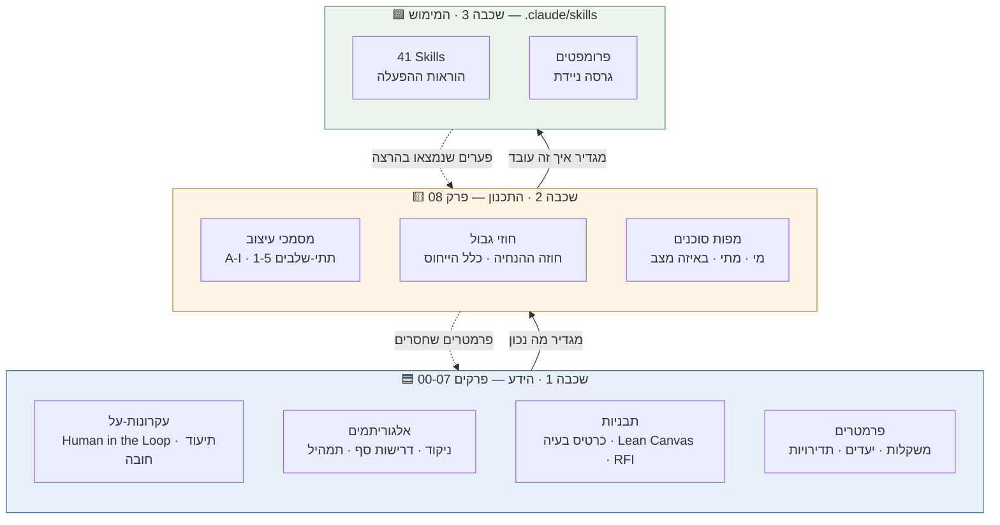
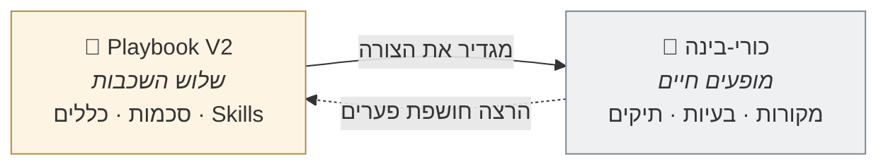
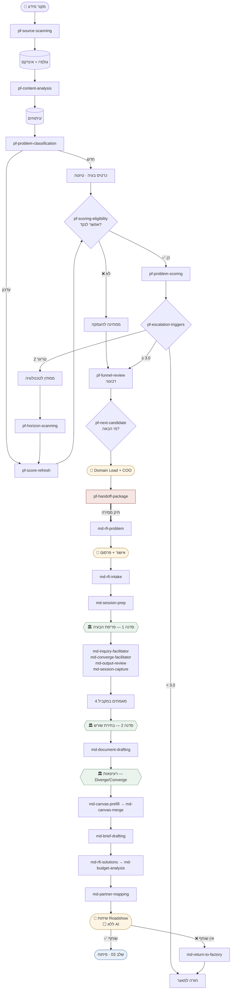
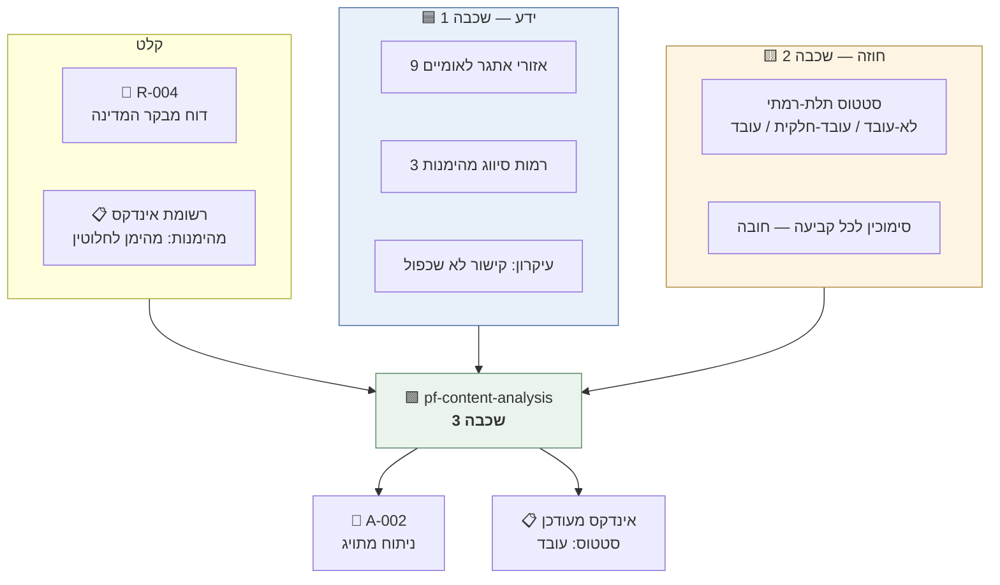
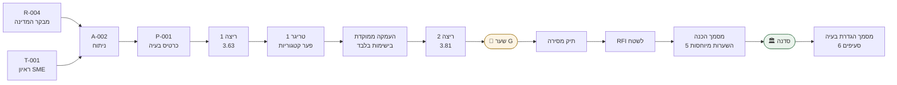
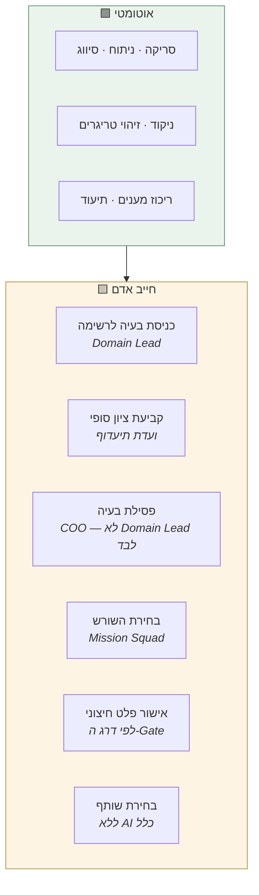

# מפת הזרימה המלאה — משלוש שכבות לצעד אחד

> **המסמך שחסר.** עד כה היו תרשימים חלקיים לכל תת-תהליך בנפרד, ודוגמה אמיתית **מפוזרת על פני 15 קבצים במעבדה**. כאן הכל במקום אחד.
>
> נוצר בעקבות משוב הצוות המיישם, 03.09.2026.

---

# חלק א' · שלוש השכבות

הצוות המיישם תיאר את המערכת כמתחלקת לשלושה אזורים. **התיאור נכון — ומעולם לא כתבנו אותו.** זו הארכיטקטורה בפועל:

## מה חי בכל שכבה

| שכבה | מה זה | מי משנה אותה | קצב שינוי |
|---|---|---|---|
| **1 · הידע** | המתודולוגיה — מה נכון לעשות | הנהלת המטה · Domain Leads | לאט, בהחלטה מתודולוגית |
| **2 · התכנון** | איך המתודולוגיה הופכת לצנרת | ארכיטקט + שותף תכנון | בסבבי עיצוב |
| **3 · המימוש** | ההוראות שרצות בפועל | מי שמתחזק את ה-Skills | בכל תיקון פער |

> ⚠️ **החצים המקווקווים הם הלולאה שגילינו בהרצות.** פערים שנמצאים בשכבה 3 מתקנים את שכבה 2, ולעיתים חושפים שחסר פרמטר בשכבה 1. **הזרימה אינה חד-כיוונית.**

## איפה הנתונים עצמם

שלוש השכבות הן **מתודולוגיה**. הנתונים החיים יושבים במקום רביעי, נפרד:

---

# חלק ב' · הזרימה המלאה — מקצה לקצה

**מקרא:** 🟨 צהוב = הכרעה אנושית · 🟩 ירוק = סדנה פיזית · 🟥 אדום = הממשק בין השלבים

> ⚠️ **שימו לב לשלושת הצמתים הצהובים.** אין מסלול מקצה לקצה שאינו עובר דרך אדם. זה לא במקרה — זהו עיקרון Human in the Loop כפי שהוא נראה בתרשים.

---

# חלק ג' · הצעד המלא — דוגמה אמיתית

הזרימה למעלה מופשטת. **הנה צעד אחד עד הסוף**, על נתונים מהמעבדה.

## הצעד: `pf-content-analysis` — ניתוח פריט גולמי

## שלוש השכבות בפועל, בצעד הזה

| השכבה | מה היא תרמה כאן | הקובץ |
|---|---|---|
| 🟦 **ידע** | תיוג לאזור אתגר 1 (הזדקנות מיטבית) · המקור סווג "מהימן לחלוטין" | [אזורי-אתגר](../01-מפעל-הבעיות/אזורי-אתגר-לאומיים.md) · [מקורות-מידע](../01-מפעל-הבעיות/מקורות-מידע.md#תיקוף-מידע-וסיווג-מהימנות) |
| 🟨 **חוזה** | הכלל שכל ממצא צריך סימוכין · סטטוס העיבוד התלת-רמתי | [A-הזנה-וסיווג](01-מפעל-הבעיות/A-הזנה-וסיווג.md) |
| 🟩 **מימוש** | ההוראה בפועל — 7 צעדי התהליך והגבולות | [`pf-content-analysis`](../.claude/skills/pf-content-analysis/SKILL.md) |

## הפלט האמיתי

מתוך [A-002](../../כורי-בינה/כור-מעבדה/01-מפעל-הבעיות/ניתוחים/A-002-רצף-טיפול-בקשישים.md):

> **ליבת הממצא:** מטופל מבוגר המשתחרר מאשפוז נופל בין שלושה גופים שאינם מעבירים מידע ביניהם אוטומטית ואינם מחזיקים אחריות מוגדרת על סגירת מעגל הטיפול.
>
> | ראיה | מקור | מהימנות |
> |---|---|---|
> | ~30% מבני 75+ חוזרים לאשפוז תוך 30 יום | מבקר המדינה | מהימן לחלוטין |
> | *"אין בעל בית"* | ראיון SME | מידע שיצרנו |

**שימו לב מה קרה כאן:** הסוכן תייג את הפלט של עצמו כ**"מידע שיצרנו"** — סיווג שאומר *"זו אינה ראיה עובדתית"*. בסבב 1 זה נראה כמו פרט טכני. **בתיקון שאחריו התברר שזה בדיוק מה שמנע ניקוד מנופח** — ראיון פנימי לא נספר כמקור עצמאי שני, והציון ירד מ-3.83 ל-3.63.

זו דוגמה לכך שהשכבות באמת עובדות יחד: **כלל משכבה 1 (סיווג מהימנות) שינה תוצאה בשכבה 3, דרך חוזה בשכבה 2.**

---

# חלק ד' · השרשרת המלאה על אותה בעיה

מ-P-001 — הבעיה היחידה שעברה את שני השלבים במעבדה:

**כל חוליה קיימת בפועל במעבדה:**

| החוליה | הקובץ |
|---|---|
| R-004 · פריט גולמי | [גולמי/רשת/R-004](../../כורי-בינה/כור-מעבדה/01-מפעל-הבעיות/גולמי/רשת/R-004-מבקר-המדינה-רצף-טיפול-בקשישים.md) |
| T-001 · ראיון SME | [גולמי/תמלולים/T-001](../../כורי-בינה/כור-מעבדה/01-מפעל-הבעיות/גולמי/תמלולים/T-001-ראיון-SME-גריאטריה.md) |
| A-002 · ניתוח | [ניתוחים/A-002](../../כורי-בינה/כור-מעבדה/01-מפעל-הבעיות/ניתוחים/A-002-רצף-טיפול-בקשישים.md) |
| P-001 · כרטיס + שתי ריצות | [בעיות/P-001](../../כורי-בינה/כור-מעבדה/01-מפעל-הבעיות/בעיות/P-001-רצף-טיפול-בקשישים.md) |
| תיק המסירה | [02/00-תיק-מסירה](../../כורי-בינה/כור-מעבדה/02-הגדרת-המיזם/00-תיק-מסירה.md) |
| RFI לשטח | [1-חקר-הבעיה/RFI-001](../../כורי-בינה/כור-מעבדה/02-הגדרת-המיזם/1-חקר-הבעיה/RFI-001-לשטח.md) |
| מסמך הכנה | [1-חקר-הבעיה/מסמך-הכנה](../../כורי-בינה/כור-מעבדה/02-הגדרת-המיזם/1-חקר-הבעיה/מסמך-הכנה.md) |
| תיעוד הסדנה | [1-חקר-הבעיה/סדנה-1](../../כורי-בינה/כור-מעבדה/02-הגדרת-המיזם/1-חקר-הבעיה/סדנה-1-תיעוד.md) |
| מסמך הגדרת בעיה | [1-חקר-הבעיה/מסמך-הגדרת-בעיה](../../כורי-בינה/כור-מעבדה/02-הגדרת-המיזם/1-חקר-הבעיה/מסמך-הגדרת-בעיה.md) |

> ⚠️ **תזכורת:** רוב הנתונים במעבדה מסומנים `[סימולציה]`. רק שני מקורות נמשכו בפועל מהרשת.

---

# חלק ה' · איפה אדם עוצר את הזרימה

**כל 41 הסוכנים הם Responsible בלבד.** אין אף סוכן שהוא Accountable על משהו.

---

## קישורים

| מה | היכן |
|---|---|
| מפת סוכנים · שלב 01 | [01-מפעל-הבעיות/מפת-סוכנים](01-מפעל-הבעיות/מפת-סוכנים.md) |
| מפת סוכנים · שלב 02 | [02-הגדרת-המיזם/מפת-סוכנים](02-הגדרת-המיזם/מפת-סוכנים.md) |
| חוזה ההנחיה | [02-הגדרת-המיזם/חוזה-ההנחיה](02-הגדרת-המיזם/חוזה-ההנחיה.md) |
| שיטת העבודה והלקחים | [00-שיטת-העבודה-ולקחים](00-שיטת-העבודה-ולקחים.md) |
| דוחות ההרצה | [סבב 1](../../כורי-בינה/כור-מעבדה/01-מפעל-הבעיות/דוח-סבב-1.md) · [סבב 2](../../כורי-בינה/כור-מעבדה/02-הגדרת-המיזם/דוח-סבב-2.md) |
