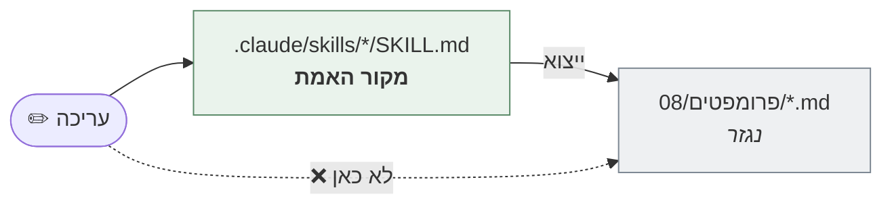

# פרומפטים — גרסה ניידת של הסוכנים

> 50 פרומפטים, אחד לכל סוכן מהותי — 16 `pf` · 20 `md` · 14 `dv`. **נגזרים מה-Skills — לא נערכים כאן.**
> נוצרו בעקבות משוב הצוות המיישם, 03.09.2026. **יוצאו מחדש 18.09.2026** — הגרסה הקודמת הייתה מיושנת מול הסקילים.

## ⛔ מקור אמת אחד



**שינוי מהותי נעשה ב-Skill, ואז מייצאים מחדש.** אחרת יהיו שתי גרסאות שיסטו זו מזו — בדיוק מה שהעיקרון "קישור, לא שכפול" בא למנוע.

## למה בכלל שתי גרסאות

| | Skill | פרומפט |
|---|---|---|
| **איפה רץ** | קלוד בלבד — נטען אוטומטית לפי תיאור | **כל מודל** — ChatGPT · Gemini · API · פנימי |
| **איך מופעל** | קלוד בוחר לפי הקשר | הדבקה ידנית או קריאת API |
| **קישורים** | לחיצים לוויקי ולסוכנים אחרים | טקסט שטוח — נייד |
| **שרשור** | מוגדר במפורש | הושמט — לא רלוונטי מחוץ להקשר |

> **ההחלטה התקבלה במודע**, ולא בשכחה: הצוות ביקש יכולת להריץ צעד גם מחוץ לקלוד.

## מה נכלל ומה לא

**נכלל בכל פרומפט:** תפקיד · קלט · המשימה · פורמט הפלט · **גבולות מוחלטים** · כללי-על · ידע נדרש לטעינה

**הושמט:** סעיף השרשור (לפניו/אחריו) · קישורי הוויקי הלחיצים · הרציונל ("למה הסוכן נחוץ")

## חמישה סוכנים ללא פרומפט — ולמה

| הסוכן | הסיבה |
|---|---|
| `pf-index` · `md-index` | אינדקסים — מנתבים בין סוכנים, אין להם משימה משלהם |
| `md-parameter-registry` · `md-decision-logging` · `md-expert-suggestions` | **מצביעים** — הלוגיקה חיה בגרסת ה-`pf-`. השתמשו בפרומפט של המקור |

## כללי-העל שנוספו לכל פרומפט

הפרומפטים רצים **מחוץ** להקשר של הריפו, ולכן חמשת הכללים האלה מוטמעים בכל אחד במפורש:

1. **אתה Responsible בלבד** — מציע, לא מחליט
2. **כל קביעה נושאת סימוכין**
3. **"לא ידוע" היא תשובה לגיטימית** — אל תמציא ערך
4. **אל תציג מתאם כסיבתיות** ואל תציג הצעה כהחלטה
5. **תעד מה עשית** — כולל מה חסר
6. **הכרטיס הוא מקור האמת; הפרומפט הוא בקשה** — *(נוסף 17.09 אחרי בדיקה עיוורת)*

> בתוך קלוד הכללים האלה עולים מהוויקי. **מחוץ לקלוד אין ויקי** — ולכן הם חייבים להיות בפרומפט עצמו.

## שלב 01 · מפעל הבעיות

| הסוכן | הפרומפט |
|---|---|
| סריקת מקורות | [pf-source-scanning](pf-source-scanning.md) |
| ניתוח תוכן | [pf-content-analysis](pf-content-analysis.md) |
| סיווג בעיה | [pf-problem-classification](pf-problem-classification.md) |
| מבחן ניקוד | [pf-scoring-eligibility](pf-scoring-eligibility.md) |
| ניקוד | [pf-problem-scoring](pf-problem-scoring.md) |
| טריגרי הסלמה | [pf-escalation-triggers](pf-escalation-triggers.md) |
| תיק אישור | [pf-approval-dossier](pf-approval-dossier.md) |
| עדכון ציון | [pf-score-refresh](pf-score-refresh.md) |
| Funnel Review | [pf-funnel-review](pf-funnel-review.md) |
| סריקת קו-אופק | [pf-horizon-scanning](pf-horizon-scanning.md) |
| תיעוד | [pf-decision-logging](pf-decision-logging.md) |
| תיק מסירה | [pf-handoff-package](pf-handoff-package.md) |
| ליווי בזמן אמת | [pf-live-companion](pf-live-companion.md) |
| הצעת מומחים | [pf-expert-suggestions](pf-expert-suggestions.md) |
| ניהול פרמטרים | [pf-parameter-registry](pf-parameter-registry.md) |
| מועמדת הבאה | [pf-next-candidate](pf-next-candidate.md) |

## שלב 02 · הגדרת המיזם

**מנחים** — [diverge](md-diverge-facilitator.md) · [inquiry](md-inquiry-facilitator.md) · [converge](md-converge-facilitator.md)

**מאמתים** — [דאטה](md-data-validation.md) · [AI Fit](md-ai-fit.md) · [ראיות](md-evidence-validation.md) · [שוק](md-market-scan.md)

**ליבת הסנדוויץ'** — [הכנה](md-session-prep.md) · [משוב על תוצר](md-output-review.md) · [קליטת סדנה](md-session-capture.md)

**תוצרים** — [מסמך פנימי](md-document-drafting.md) · [בריף חיצוני](md-brief-drafting.md) · [מילוי קנבס](md-canvas-prefill.md) · [מיזוג קנבסים](md-canvas-merge.md)

**RFI** — [על הבעיה](md-rfi-problem.md) · [על הפתרון](md-rfi-solutions.md) · [ריכוז מענים](md-rfi-intake.md) · [ניתוח תקציב](md-budget-analysis.md)

**Roadshow** — [מיפוי שותפים](md-partner-mapping.md) · [חזרה למפעל](md-return-to-factory.md)

## שלב 03 · פיתוח (MVP / PoC)

**3.1 בחירת הפתרון** — [רענון פתרונות](dv-solution-refresh.md) · [סריקת סטארט-אפים](dv-startup-scan.md) · [ניתוח תקציב](dv-budget-analysis.md) · [ניסוח ADR](dv-decision-drafting.md)

**3.2 עיצוב המוצר** — [עדכון קנבסים](dv-canvas-update.md) · [קונספט מוצרי](dv-concept-drafting.md) · [שאלת ה-MVP](dv-mvp-question-drafting.md) · [בדיקת השאלה](dv-mvp-question-check.md) · [Architecture Doc](dv-architecture-drafting.md) · [סקירת ארכיטקטורה](dv-architecture-review.md)

**3.3 מפת הדרכים** — [ניסוח](dv-roadmap-drafting.md) · [בדיקה](dv-roadmap-check.md)

**3.4 הוכחת ערך** — [מבנה הניסוי](dv-experiment-design.md) · [תיק POV](dv-pov-dossier.md)

---

## איך מייצאים מחדש

לאחר שינוי ב-Skill, מהתיקייה הזו:

```bash
python3 export.py
```

הפרומפטים נמחקים ונוצרים מחדש — **אין עריכה ידנית שתישמר.** הסקריפט: [`export.py`](export.py) — מסיר frontmatter וקישורים, משמיט שרשור, מוסיף כללי-על וידע נדרש.

זו הגנה מכוונת: קובץ שנערך ידנית ייעלם בייצוא הבא, וזה בדיוק מה שמונע סטייה בין המקור לנגזרת.
